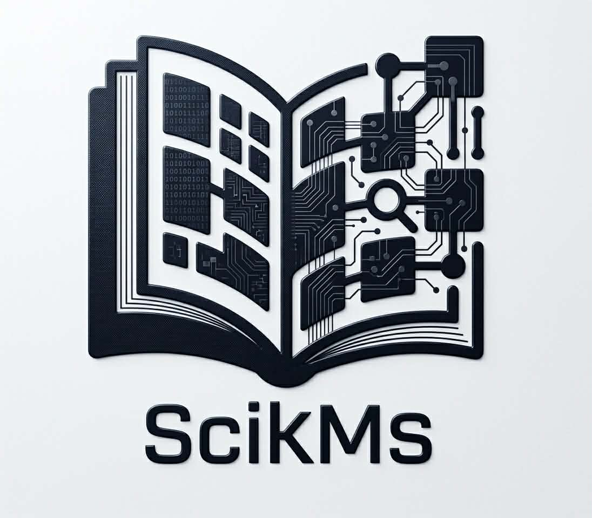

<p align="center">
  
</p>

<h1 align="center">SciKMS</h1>

<p align="center">
  <strong>Clinical Knowledge Manager</strong> — a desktop app for medical research papers, with evidence-based medicine classifiers, figure atlas, and full-text search. Built for clinicians who read papers every day.
</p>

<p align="center">
  <a href="LICENSE"></a>
</p>

---

## What it is

SciKMS is a **local, offline-first library** for your personal collection of medical research papers. Import PDFs by drag-and-drop, DOI lookup, or PubMed search. The app auto-classifies each paper by evidence level (EBM I–V), study design, and clinical specialty. It extracts figures from the PDF into a browsable atlas, indexes everything with SQLite FTS5 full-text search, and exports to Zotero / EndNote / LaTeX / Excel.

No account. No cloud. Built by doctors. Use for doctors 


## Install

### Download a prebuilt binary (recommended)

Grab the latest from [Releases](https://github.com/SciKMS/scikms/releases):

- **macOS (arm64):** `SciKMS-<version>-macOS<os>-arm64.zip` — unzip, drag `SciKMS.app` to `/Applications`. First launch: right-click → **Open** (unsigned).
- **Windows (x64):** `SciKMS-<version>-windows-x64.zip` — unzip, run `SciKMS\SciKMS.exe`.

### Build from source

Requirements: **Python ≥ 3.10**, [`uv`](https://docs.astral.sh/uv/getting-started/installation/).

```bash
git clone https://github.com/SciKMS/scikms.git
cd scikms
uv sync --dev

# Run
uv run scikms

# Or bundle a distributable:
make bundle-mac    # → dist/SciKMS.app
make bundle-win    # → dist\SciKMS\SciKMS.exe  (Windows host)
```

## License

**GPL-3.0-or-later.** See [LICENSE](LICENSE) for the full text.

